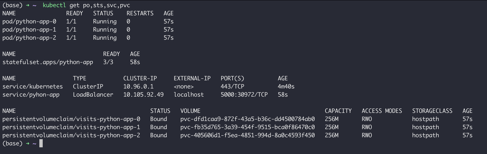
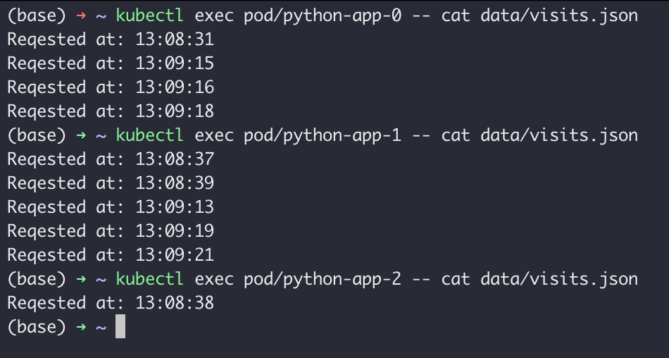

# K8S StatefulSet

The difference between visites exists because we configured StatefulSet in such a way, so each pod has its own PVC. As requests are processed by different pods, so each pod should have a different PVC.

Our pods work independently of each other, they do not have any logical connections. So, we can start/terminate pods in parallel. To start/terminate our pods in parallel in StatefulSet ccontroller we should add `podManagementPolicy: "Parallel"`.