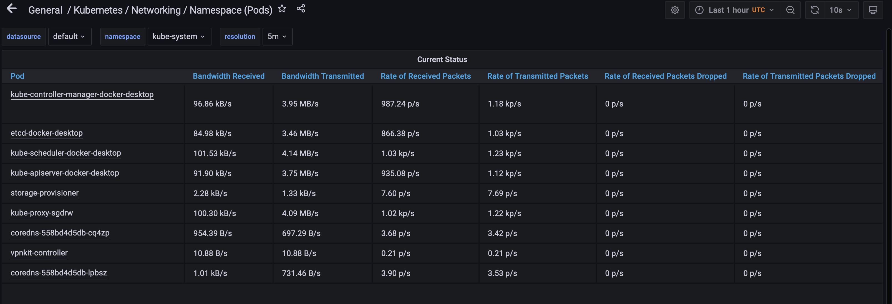

# K8S

## All components of the prometheus stack

* Prometheus Operator
Operator that play role as adaptor o integrae with kubernetes.

* Highly available Prometheus
Metrics engine that integrates with Grafana, can collect and control metrics data.

* Highly available Alertmanager
Handle and proccess alerts from client application. Also handle deduplicating, grouping, and routing. Can route to specific destination(email f.e.).

* Prometheus node-exporter
Collect such metrisc as OS and hardware from k8s node.

* Prometheus Adapter for Kubernetes Metrics APIs
Uses for making decision about scaling, use k8s metrics API and Prometheus API.

* kube-state-metrics
Generate metrics of state kubernetes objects. It gets state of objects like: deployments, nodes and pods, not of k8s components.

* Grafana
Web application that can integrate with huge plugins as Prometheus and show it in ccustomizable dashboard.

`kubectl get po,sts,svc,pvc,cm`

### CPU and Memory StatefulSet

### Which Pod is using CPU more than others and which is less in the default namespace

### How much memory is used on your node, in % and mb

### How many pods and containers actually ran by the Kubelet service

### Which Pod is using network more than others and which is less in the default namespace

### How many alerts you have

