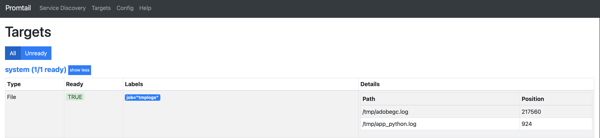
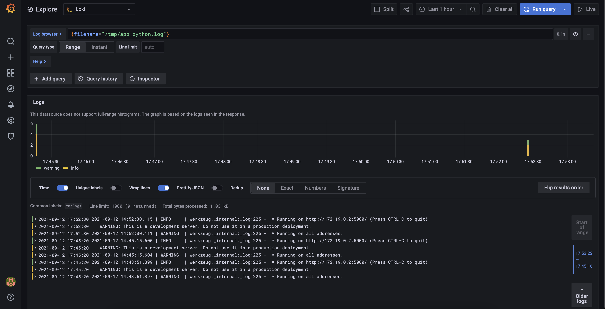

# Logging
 ## Screenshots

 
 

Python app logs into `/tmp/app_python.log`.
Also, I am an ambassador of `loguru`. I prefer to use this logging manager instead of standart logging.

 ## Found bugs

 ## Loki best practices
1. Static labels are good
2. Use dynamic labels sparingly
3. Label values must always be bounded
4. Be aware of dynamic labels applied by clients
5. Configure caching
6. Logs must be in increasing time order per stream

## Logging best practices
1. Logging Levels separation
2. Basic Logging Configuration in the entrypoint
3. Don’t Reinvent the Wheel
4. Use the Correct Levels When Logging
5. Include a Timestamp for Each Log Entry
6. Use the Rotating
